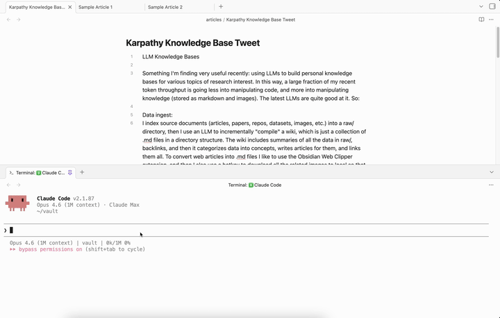

# Drift

A VS Code-style side-by-side diff viewer that lives inside Obsidian. Automatically detects external file changes (including AI coding agents) and shows you a before/after view with per-chunk accept/reject, accept all/reject all, and collapsible unchanged regions.

## Features

- **Instant detection** — No polling or delays. Uses CodeMirror 6 transaction monitoring to detect external changes the moment they happen.
- **Per-chunk accept/reject** — Cherry-pick individual changes, not just all-or-nothing. Revert buttons on each diff chunk let you keep what you want and undo what you don't.
- **Accept all / Reject all** — Bulk actions when you have multiple files with pending diffs.
- **Persistence** — Pending diffs survive Obsidian restarts. Stale diffs (file deleted or reverted) are automatically discarded on reload.
- **Edit protection** — Editing a file with pending diffs shows a warning modal, preventing accidental data loss.
- **Tool-agnostic** — Works with any tool that modifies vault files: AI coding agents, sync services, scripts, other plugins.

## Installation

Install Drift from the [Obsidian community plugin directory](https://community.obsidian.md/plugins/drift).

### Manual install

1. Download `main.js`, `manifest.json`, and `styles.css` from the [latest release](https://github.com/ryanbbrown/obsidian-drift/releases)
2. Create a folder `VaultFolder/.obsidian/plugins/drift/`
3. Copy the downloaded files into that folder
4. Restart Obsidian and enable the plugin in **Settings → Community plugins**

## Usage

Once enabled, the plugin runs automatically. When an external tool modifies a markdown file in your vault:

1. A **Drift** tab opens in the background showing the side-by-side diff
2. Use **Accept All** to keep the new content, or **Reject All** to revert to the original
3. Use the **revert button** on individual chunks to selectively undo specific changes
4. Use the **Open diff viewer** command to reopen the tab if you close it

## Commands

| Command | Description |
|---------|-------------|
| **Open diff viewer** | Open or focus the diff viewer tab |
| **Toggle external change detection** | Enable/disable external change detection |
